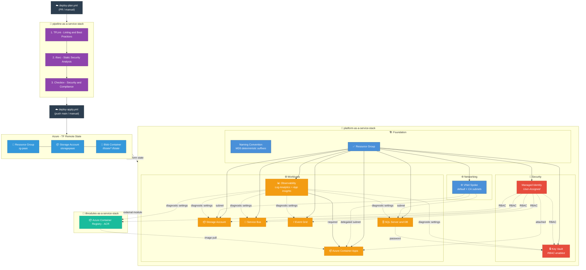

# Platform as a Service Stack

Azure infrastructure platform for accelerating product development through composable, secure, and reusable infrastructure capabilities.

> **Version 3.0.0**: Full implementation with deterministic naming conventions (MD5 suffixes), RBAC-enabled security, and comprehensive feature flags.

---

## Core Implementation
- ✅ **Deterministic Naming**: MD5-based suffixes for globally unique resource names (no `random_string` destroy/recreate cycles)
- ✅ **RBAC-First Security**: All resources use Azure AD authentication and role-based access
- ✅ **Feature Flags**: All resources optional via `enable_*` variables with proper dependency validation
- ✅ **Time-based RBAC Propagation**: 180s `time_sleep` before creating secrets to ensure Azure AD RBAC propagation
- ✅ **Deterministic Role Assignments**: All role assignments use `uuidv5()` for stable IDs across applies
- ✅ **Complete Observability**: Diagnostic settings integrated when Observability is enabled

### Key Resources Implemented
- **Foundation**: Resource Group (with `prevent_destroy`), Naming Convention, Managed Identity
- **Networking**: VNet Spoke with default + delegated subnets for Container Apps
- **Security**: Key Vault (RBAC-enabled), Managed Identity
- **Workloads**: Storage Account (Azure AD only), Service Bus (Standard), Event Grid, SQL Server (AAD admin), Observability, Container Registry (ACR), Container Apps
- **Zero-Config Integration**: Container Apps Environment ships with MI attached + ACR roles pre-wired — devs only set image name

---

## Quick Start

### 1. Prerequisites

- Azure Subscription
- Terraform 1.9.0+
- GitHub repository with Actions enabled
- Azure Service Principal with appropriate permissions

### 2. Configure GitHub Secrets

Add the following secrets to your repository:
- `AZURE_CLIENT_ID`
- `AZURE_CLIENT_SECRET`
- `AZURE_TENANT_ID`
- `AZURE_SUBSCRIPTION_ID`

### 3. Provision Infrastructure

#### Via GitHub Actions (Recommended)

The platform uses two separate workflows:

- **Plan** (`deploy-plan.yml`): Triggered on Pull Requests to `main` or manually via `workflow_dispatch`. Runs [pipeline-as-a-service-stack](../pipeline-as-a-service-stack) core validation (TFLint, tfsec, Checkov) before planning.
- **Apply** (`deploy-apply.yml`): Triggered on push to `main` or manually via `workflow_dispatch`. Executes `terraform apply` with auto-approve.

**To deploy:**
1. Go to **Actions** → **Deploy Platform Infrastructure** (apply) or **Plan Platform Infrastructure** (plan)
2. Click **Run workflow**
3. Fill in the platform name (lowercase alphanumeric only)
4. Select resources to provision using feature flag checkboxes
5. Review the plan output (posted as PR comment on plan workflow)

> **Note**: Destroy is not available via workflow. To destroy resources, delete the Resource Group in Azure Portal and remove the state file from the storage account.

**State Protection**: Both workflows check existing Terraform state and force-enable flags for resources already provisioned, preventing accidental destruction.


---

## Feature Flags

All resources are controlled via boolean feature flags. Enable only what you need:

| Flag | Resource | Default | Dependencies |
|------|----------|---------|--------------|
| `enable_managed_identity` | User-Assigned Managed Identity | `true` | **Recommended by**: Storage, Service Bus, Event Grid, SQL, Key Vault |
| `enable_vnet` | Virtual Network Spoke | `true` | None |
| `enable_observability` | Log Analytics + App Insights | `true` | **Required by**: Container Apps |
| `enable_key_vault` | Key Vault with RBAC | `true` | Uses: Managed Identity, SQL (stores password) |
| `enable_storage` | Storage Account | `true` | Uses: Managed Identity, VNet |
| `enable_service_bus` | Service Bus Namespace | `true` | Uses: Managed Identity |
| `enable_event_grid` | Event Grid Domain | `true` | Uses: Managed Identity, Service Bus |
| `enable_sql` | SQL Server & Database | `true` | Uses: Managed Identity, VNet |
| `enable_container_registry` | Container Registry (ACR) | `true` | Uses: Managed Identity |
| `container_registry_sku` | Container Registry SKU | `"Basic"` | Basic, Standard, Premium |
| `enable_container_apps` | Container Apps Environment | `true` | **Requires**: Observability; Uses: Container Registry, MI |

---

## Resource Dependencies

```
┌─────────────────────────────────────────────────────────────────────────────┐
│                        RECURSOS INDEPENDENTES                                │
│  (podem ser criados sem dependências)                                        │
├─────────────────────────────────────────────────────────────────────────────┤
│  ✅ Resource Group      - Sempre criado (base de tudo)                       │
│  🔐 Managed Identity    - Opcional (enable_managed_identity)                 │
│      ⚠️  RECOMENDADO por: Storage, Service Bus, Event Grid, SQL, Key Vault  │
│  🌐 VNet Spoke          - Opcional (enable_vnet)                             │
│  📊 Observability       - Opcional (enable_observability)                    │
│  📦 Container Registry  - Opcional (enable_container_registry)               │
└─────────────────────────────────────────────────────────────────────────────┘
                                    │
                                    ▼
┌─────────────────────────────────────────────────────────────────────────────┐
│                      RECURSOS COM DEPENDÊNCIAS OPCIONAIS                     │
│  (podem usar outros recursos se habilitados)                                 │
├─────────────────────────────────────────────────────────────────────────────┤
│  📦 Storage Account                                                          │
│      └── Usa: Managed Identity (RBAC), VNet (network rules)                  │
│  📨 Service Bus                                                              │
│      └── Usa: Managed Identity (RBAC)                                        │
│  ⚡ Event Grid                                                               │
│      └── Usa: Managed Identity (RBAC), Service Bus (subscriptions)           │
│  🗄️ SQL Server & Database                                                   │
│      └── Usa: Managed Identity (RBAC), VNet (firewall rules)                 │
│  🔐 Key Vault                                                                │
│      └── Usa: Managed Identity (RBAC)                                        │
│      └── Armazena: SQL password (se enable_sql=true)                         │
│  📦 Container Registry                                                       │
│      └── Usa: Managed Identity (RBAC: AcrPush + AcrPull)                     │
└─────────────────────────────────────────────────────────────────────────────┘
                                    │
                                    ▼
┌─────────────────────────────────────────────────────────────────────────────┐
│                      RECURSOS COM DEPENDÊNCIAS OBRIGATÓRIAS                  │
│  (REQUEREM outros recursos para funcionar)                                   │
├─────────────────────────────────────────────────────────────────────────────┤
│  📦 Container Apps                                                           │
│      └── REQUER: Observability (Log Analytics workspace_id)                  │
│      └── Usa: VNet (infrastructure_subnet_id) [opcional]                     │
│      └── Usa: Container Registry (login_server) [opcional]                   │
│      └── Usa: Managed Identity (attached to Environment) [opcional]          │
│      ⚠️  NÃO será criado se enable_observability = false                     │
└─────────────────────────────────────────────────────────────────────────────┘
```

### Dependency Matrix

| Recurso | Depende de (OBRIGATÓRIO) | Usa (OPCIONAL) | Condição de Criação |
|---------|-------------------------|----------------|---------------------|
| Resource Group | - | - | Sempre criado |
| Managed Identity | Resource Group | - | `enable_managed_identity = true` |
| VNet Spoke | Resource Group | - | `enable_vnet = true` |
| Observability | Resource Group | - | `enable_observability = true` |
| Storage Account | Resource Group | Managed Identity, VNet | `enable_storage = true` |
| Service Bus | Resource Group | Managed Identity | `enable_service_bus = true` |
| Event Grid | Resource Group | Managed Identity, Service Bus | `enable_event_grid = true` |
| SQL | Resource Group | Managed Identity, VNet | `enable_sql = true` |
| Key Vault | Resource Group | Managed Identity, SQL* | `enable_key_vault = true` |
| Container Registry | Resource Group | Managed Identity | `enable_container_registry = true` |
| **Container Apps** | **Observability** | VNet, Container Registry, MI | `enable_container_apps = true AND enable_observability = true` |

> \* Key Vault depends on SQL only to store the generated password. If `enable_sql = false`, Key Vault is created without secrets.

---

## Usage Examples

### Deploy Completo (all resources)
```hcl
name = "myplatform"
# All enable_* flags default to true
# Includes: MI, VNet, Observability, Key Vault, Storage, Service Bus, Event Grid, SQL, Container Registry, Container Apps
```

## Naming Conventions

All resources follow [Microsoft Cloud Adoption Framework](https://learn.microsoft.com/en-us/azure/cloud-adoption-framework/ready/azure-best-practices/resource-naming) standards with deterministic MD5 suffixes for global uniqueness:

### Naming Pattern Details

- **MD5 Suffix**: Generated from `substr(md5(var.name), 0, 4)` - same name always produces same suffix
- **Location Abbreviations**: eastus2=eus2, westus2=wus2, etc.
- **Deterministic**: NO random suffixes - ensures stable resource names across applies

| Resource | Pattern | Example | Notes |
|----------|---------|---------|-------|
| Resource Group | `rg-{name}-{region}` | `rg-myplatform-eus2` | Lifecycle: prevent_destroy=true |
| Virtual Network | `vnet-{name}-{region}` | `vnet-myplatform-eus2` | Contains default + delegated subnets |
| Container Apps Subnet | `snet-ca-{name}-{region}` | `snet-ca-myplatform-eus2` | /27 minimum, delegated to Microsoft.App/environments |
| Managed Identity | `id-{name}-{region}` | `id-myplatform-eus2` | User-Assigned type |
| Key Vault | `kv{name}{region}{md5}` | `kvmyplatformeus2abc1` | RBAC-enabled, 180s RBAC propagation delay |
| Storage Account | `st{name}{region}{md5}` | `stmyplatformeus2abc1` | No shared keys, Azure AD only, blobs + containers |
| Service Bus | `sb-{name}-{region}-{md5}` | `sb-myplatform-eus2-abc1` | Standard tier, includes Queue and Topic |
| Event Grid Domain | `evgd-{name}-{region}` | `evgd-myplatform-eus2` | Domain type for event routing, Service Bus integration |
| SQL Server | `sql-{name}-{region}-{md5}` | `sql-myplatform-eus2-abc1` | System-Assigned identity, AAD admin, TLS 1.2+ |
| SQL Database | `sqldb-{name}-{region}` | `sqldb-myplatform-eus2` | Elastic pool compatible, diagnostic logging |
| Log Analytics | `log-{name}-{region}` | `log-myplatform-eus2` | 30-day retention, workspace for diagnostic settings |
| App Insights | `appi-{name}-{region}` | `appi-myplatform-eus2` | Type: web, linked to Log Analytics |
| Container Registry | `cr{name}{region}{md5}` | `crmyplatformeus2abc1` | Alphanumeric only, ACR Push/Pull RBAC auto-assigned |
| Container Apps Env | `cae-{name}-{region}-{md5}` | `cae-myplatform-eus2-abc1` | Requires Log Analytics, MI + ACR pre-wired, /27 delegated subnet optional |

---

## Architecture

```
┌─────────────────────────────────────────────────────────┐
│                    GitHub Actions                        │
│    deploy-plan.yml ──► pipeline-core validation          │
│    deploy-apply.yml ──► terraform apply                  │
└────────────────────┬────────────────────────────────────┘
                     │
                     ▼
┌─────────────────────────────────────────────────────────┐
│            pipeline-as-a-service-stack                    │
│   (TFLint, tfsec, Checkov, terraform-docs, tf-cost)      │
└────────────────────┬────────────────────────────────────┘
                     │
                     ▼
┌─────────────────────────────────────────────────────────┐
│                  Terraform Modules                       │
├─────────────────────────────────────────────────────────┤
│ Foundation  │ naming, resource-group                     │
│ Networking  │ vnet-spoke                                 │
│ Security    │ managed-identity, key-vault                │
│ Workloads   │ storage, service-bus, event-grid,          │
│             │ observability, sql, container-registry*,   │
│             │ container-apps                             │
└─────────────────────────────────────────────────────────┘
                     │
                     ▼
┌─────────────────────────────────────────────────────────┐
│                   Azure Resources                        │
└─────────────────────────────────────────────────────────┘

* container-registry sourced from tfmodules-as-a-service-stack (external module)
```

---

## Repository Structure

```
platform-as-a-service-stack/
├── .github/
│   ├── agents/                      # Copilot agent definitions
│   │   ├── agent.agent.md
│   │   ├── azure-agent.md
│   │   ├── github-actions-agent.md
│   │   └── terraform-agent.md
│   ├── instructions/                # Copilot coding instructions
│   │   ├── azure-instructions.md
│   │   ├── github-actions-platform-instructions.md
│   │   └── terraform-platform-instructions.md
│   ├── prompts/                     # Copilot prompt templates
│   │   ├── azure-prompt.md
│   │   ├── github-actions-prompt.md
│   │   └── terraform-prompt.md
│   ├── skills/                      # Copilot skills
│   │   ├── azure-platform-stack/
│   │   ├── github-actions-platform-stack/
│   │   └── terraform-platform-stack/
│   └── workflows/
│       ├── deploy-apply.yml         # Apply workflow (push to main / manual)
│       └── deploy-plan.yml          # Plan workflow (PR to main / manual)
├── terraform/
│   ├── modules/
│   │   ├── foundation/
│   │   │   ├── naming/              # Naming convention module
│   │   │   └── resource-group/      # Resource group module
│   │   ├── networking/
│   │   │   └── vnet-spoke/          # Virtual network module
│   │   ├── security/
│   │   │   ├── managed-identity/    # Managed identity module
│   │   │   └── key-vault/           # Key vault module
│   │   └── workloads/
│   │       ├── storage-account/     # Storage account module
│   │       ├── service-bus/         # Service Bus module
│   │       ├── event-grid/          # Event Grid module
│   │       ├── observability/       # Log Analytics + App Insights
│   │       ├── sql/                 # SQL Server & Database
│   │       └── container-apps/      # Container Apps module
│   │       # container-registry → external: tfmodules-as-a-service-stack
│   ├── backend.tf                   # Remote state configuration
│   ├── providers.tf                 # Provider configuration
│   ├── main.tf                      # Root module orchestration
│   ├── variables.tf                 # Input variables with feature flags
│   └── outputs.tf                   # Platform outputs
├── prompt.md                        # Project specification
└── README.md                        # This file
```

<!-- BEGIN_TF_DOCS -->
## Requirements

| Name | Version |
|------|---------|
| <a name="requirement_terraform"></a> [terraform](#requirement\_terraform) | >= 1.9.0 |
| <a name="requirement_azurerm"></a> [azurerm](#requirement\_azurerm) | ~> 4.57 |
| <a name="requirement_null"></a> [null](#requirement\_null) | ~> 3.2 |
| <a name="requirement_random"></a> [random](#requirement\_random) | ~> 3.8 |
| <a name="requirement_time"></a> [time](#requirement\_time) | ~> 0.13 |

## Providers

| Name | Version |
|------|---------|
| <a name="provider_azurerm"></a> [azurerm](#provider\_azurerm) | ~> 4.57 |
| <a name="provider_null"></a> [null](#provider\_null) | ~> 3.2 |

## Modules

| Name | Source | Version |
|------|--------|---------|
| <a name="module_container_apps"></a> [container\_apps](#module\_container\_apps) | ./modules/workloads/container-apps | n/a |
| <a name="module_container_registry"></a> [container\_registry](#module\_container\_registry) | git::https://github.com/orafaelferreiraa/tfmodules-as-a-service-stack.git//modules/azurerm_container_registry | 1.0.3 |
| <a name="module_event_grid"></a> [event\_grid](#module\_event\_grid) | ./modules/workloads/event-grid | n/a |
| <a name="module_key_vault"></a> [key\_vault](#module\_key\_vault) | ./modules/security/key-vault | n/a |
| <a name="module_managed_identity"></a> [managed\_identity](#module\_managed\_identity) | ./modules/security/managed-identity | n/a |
| <a name="module_naming"></a> [naming](#module\_naming) | ./modules/foundation/naming | n/a |
| <a name="module_observability"></a> [observability](#module\_observability) | ./modules/workloads/observability | n/a |
| <a name="module_resource_group"></a> [resource\_group](#module\_resource\_group) | ./modules/foundation/resource-group | n/a |
| <a name="module_service_bus"></a> [service\_bus](#module\_service\_bus) | ./modules/workloads/service-bus | n/a |
| <a name="module_sql"></a> [sql](#module\_sql) | ./modules/workloads/sql | n/a |
| <a name="module_storage_account"></a> [storage\_account](#module\_storage\_account) | ./modules/workloads/storage-account | n/a |
| <a name="module_vnet_spoke"></a> [vnet\_spoke](#module\_vnet\_spoke) | ./modules/networking/vnet-spoke | n/a |

## Resources

| Name | Type |
|------|------|
| [azurerm_client_config.current](https://registry.terraform.io/providers/hashicorp/azurerm/latest/docs/data-sources/client_config) | data source |

## Inputs

| Name | Description | Type | Default | Required |
|------|-------------|------|---------|:--------:|
| <a name="input_enable_container_apps"></a> [enable\_container\_apps](#input\_enable\_container\_apps) | Enable Container Apps Environment | `bool` | `true` | no |
| <a name="input_enable_container_registry"></a> [enable\_container\_registry](#input\_enable\_container\_registry) | Enable Container Registry (ACR) | `bool` | `true` | no |
| <a name="input_container_registry_sku"></a> [container\_registry\_sku](#input\_container\_registry\_sku) | SKU of the Container Registry. Possible values: Basic, Standard, Premium | `string` | `"Basic"` | no |
| <a name="input_enable_event_grid"></a> [enable\_event\_grid](#input\_enable\_event\_grid) | Enable Event Grid | `bool` | `true` | no |
| <a name="input_enable_key_vault"></a> [enable\_key\_vault](#input\_enable\_key\_vault) | Enable Key Vault | `bool` | `true` | no |
| <a name="input_enable_managed_identity"></a> [enable\_managed\_identity](#input\_enable\_managed\_identity) | Enable Managed Identity (required by: Storage, Service Bus, Event Grid, SQL, Key Vault for RBAC) | `bool` | `true` | no |
| <a name="input_enable_observability"></a> [enable\_observability](#input\_enable\_observability) | Enable Observability (Log Analytics, Application Insights) | `bool` | `true` | no |
| <a name="input_enable_service_bus"></a> [enable\_service\_bus](#input\_enable\_service\_bus) | Enable Service Bus | `bool` | `true` | no |
| <a name="input_enable_sql"></a> [enable\_sql](#input\_enable\_sql) | Enable SQL Server and Database | `bool` | `true` | no |
| <a name="input_enable_storage"></a> [enable\_storage](#input\_enable\_storage) | Enable Storage Account | `bool` | `true` | no |
| <a name="input_enable_vnet"></a> [enable\_vnet](#input\_enable\_vnet) | Enable Virtual Network Spoke | `bool` | `true` | no |
| <a name="input_location"></a> [location](#input\_location) | Azure region for resources | `string` | `"eastus2"` | no |
| <a name="input_name"></a> [name](#input\_name) | Name for the platform (team or product - lowercase alphanumeric) | `string` | n/a | yes |
| <a name="input_sql_administrator_login"></a> [sql\_administrator\_login](#input\_sql\_administrator\_login) | SQL Server administrator login name | `string` | `"sql_admin"` | no |
| <a name="input_subscription_id"></a> [subscription\_id](#input\_subscription\_id) | Azure Subscription ID | `string` | n/a | yes |
| <a name="input_tags"></a> [tags](#input\_tags) | Common tags to apply to all resources | `map(string)` | `{}` | no |

## Outputs

| Name | Description |
|------|-------------|
| <a name="output_application_insights_connection_string"></a> [application\_insights\_connection\_string](#output\_application\_insights\_connection\_string) | Connection string for Application Insights |
| <a name="output_application_insights_instrumentation_key"></a> [application\_insights\_instrumentation\_key](#output\_application\_insights\_instrumentation\_key) | Instrumentation key for Application Insights |
| <a name="output_container_apps_environment_id"></a> [container\_apps\_environment\_id](#output\_container\_apps\_environment\_id) | ID of the Container Apps Environment |
| <a name="output_container_apps_environment_name"></a> [container\_apps\_environment\_name](#output\_container\_apps\_environment\_name) | Name of the Container Apps Environment |
| <a name="output_container_apps_environment_default_domain"></a> [container\_apps\_environment\_default\_domain](#output\_container\_apps\_environment\_default\_domain) | Default domain of the Container Apps Environment |
| <a name="output_container_apps_environment_static_ip"></a> [container\_apps\_environment\_static\_ip](#output\_container\_apps\_environment\_static\_ip) | Static IP address of the Container Apps Environment |
| <a name="output_container_app_ready_config"></a> [container\_app\_ready\_config](#output\_container\_app\_ready\_config) | Zero-config for Container Apps. MI attached to Environment with AcrPull/AcrPush on ACR |
| <a name="output_container_registry_id"></a> [container\_registry\_id](#output\_container\_registry\_id) | ID of the Container Registry |
| <a name="output_container_registry_name"></a> [container\_registry\_name](#output\_container\_registry\_name) | Name of the Container Registry |
| <a name="output_container_registry_login_server"></a> [container\_registry\_login\_server](#output\_container\_registry\_login\_server) | Login server URL of the Container Registry |
| <a name="output_event_grid_domain_id"></a> [event\_grid\_domain\_id](#output\_event\_grid\_domain\_id) | ID of the Event Grid domain |
| <a name="output_key_vault_id"></a> [key\_vault\_id](#output\_key\_vault\_id) | ID of the Key Vault |
| <a name="output_key_vault_uri"></a> [key\_vault\_uri](#output\_key\_vault\_uri) | URI of the Key Vault |
| <a name="output_log_analytics_workspace_id"></a> [log\_analytics\_workspace\_id](#output\_log\_analytics\_workspace\_id) | ID of the Log Analytics Workspace |
| <a name="output_managed_identity_client_id"></a> [managed\_identity\_client\_id](#output\_managed\_identity\_client\_id) | Client ID of the managed identity |
| <a name="output_managed_identity_id"></a> [managed\_identity\_id](#output\_managed\_identity\_id) | ID of the managed identity |
| <a name="output_managed_identity_principal_id"></a> [managed\_identity\_principal\_id](#output\_managed\_identity\_principal\_id) | Principal ID of the managed identity |
| <a name="output_resource_group_id"></a> [resource\_group\_id](#output\_resource\_group\_id) | ID of the resource group |
| <a name="output_resource_group_name"></a> [resource\_group\_name](#output\_resource\_group\_name) | Name of the resource group |
| <a name="output_service_bus_namespace_id"></a> [service\_bus\_namespace\_id](#output\_service\_bus\_namespace\_id) | ID of the Service Bus namespace |
| <a name="output_service_bus_namespace_name"></a> [service\_bus\_namespace\_name](#output\_service\_bus\_namespace\_name) | Name of the Service Bus namespace |
| <a name="output_sql_database_id"></a> [sql\_database\_id](#output\_sql\_database\_id) | ID of the SQL database |
| <a name="output_sql_server_fqdn"></a> [sql\_server\_fqdn](#output\_sql\_server\_fqdn) | FQDN of the SQL server |
| <a name="output_sql_server_id"></a> [sql\_server\_id](#output\_sql\_server\_id) | ID of the SQL server |
| <a name="output_storage_account_id"></a> [storage\_account\_id](#output\_storage\_account\_id) | ID of the storage account |
| <a name="output_storage_account_name"></a> [storage\_account\_name](#output\_storage\_account\_name) | Name of the storage account |
| <a name="output_vnet_id"></a> [vnet\_id](#output\_vnet\_id) | ID of the VNet |
| <a name="output_vnet_name"></a> [vnet\_name](#output\_vnet\_name) | Name of the VNet |
<!-- END_TF_DOCS -->

---

## Architecture Diagram

