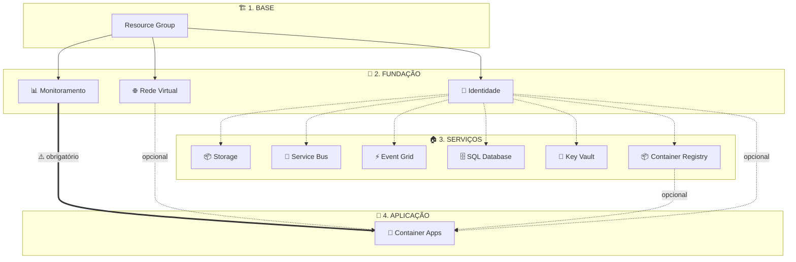
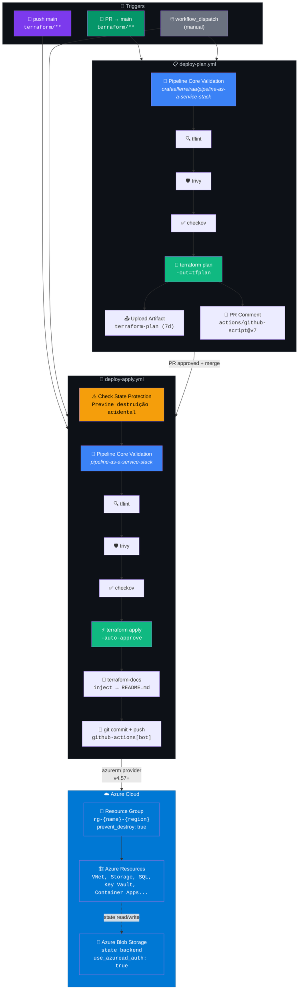
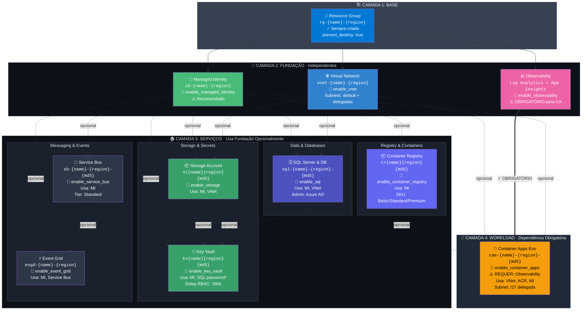

# Platform as a Service Stack

Plataforma de infraestrutura Azure para acelerar o desenvolvimento de produtos através de capacidades de infraestrutura composíveis, seguras e reutilizáveis.

---

## O que é Engenharia de Plataforma?

Imagine que cada time de desenvolvimento precisa construir a própria casa antes de começar a morar nela — instalar encanamento, eletricidade, internet, alarme... **toda vez, do zero**. Isso é o que acontece quando não existe uma plataforma.

 O time de plataforma entrega a infraestrutura completa: rede, segurança, banco de dados, monitoramento. E os times de produto só precisam se preocupar com o que realmente importa: **o código do produto**.

### Por que usar?

| Problema sem plataforma | Solução com plataforma |
|------------------------|----------------------|
| Cada time configura infra do zero | Infra pronta em minutos com feature flags |
| Configurações inconsistentes entre times | Padrão único, seguro e auditável |
| Deploy manual e propenso a erros | Pipeline automatizada (CI/CD) |
| Semanas para subir um ambiente | Minutos para provisionar tudo |

### Na prática (o que vamos construir)

```
Dev pede um ambiente → Liga os feature flags → Terraform cria tudo → App roda em Container Apps
```

Tudo **automatizado**, **seguro** e **repetível**. O desenvolvedor não precisa saber como a rede funciona, ele só precisa saber o nome da imagem Docker.


---

## Implementação Principal
- ✅ **Nomenclatura Determinística**: Sufixos baseados em MD5 para nomes de recursos globalmente únicos (sem ciclos de destroy/recreate do `random_string`)
- ✅ **Segurança RBAC-First**: Todos os recursos usam autenticação Azure AD e controle de acesso baseado em roles
- ✅ **Feature Flags**: Todos os recursos são controlados via variáveis `enable_*` sem defaults — valores definidos pela pipeline
- ✅ **Propagação RBAC Temporizada**: 180s de `time_sleep` antes de criar secrets para garantir propagação do RBAC no Azure AD
- ✅ **Role Assignments Determinísticos**: Todos os role assignments usam `uuidv5()` para IDs estáveis entre applies
- ✅ **Observabilidade Completa**: Diagnostic settings integrados quando a Observabilidade está habilitada

### Recursos Implementados
- **Fundação**: Resource Group (com `prevent_destroy`), Convenção de Nomenclatura, Managed Identity
- **Rede**: VNet Spoke com subnets default + delegadas para Container Apps
- **Segurança**: Key Vault (RBAC habilitado), Managed Identity
- **Workloads**: Storage Account (somente Azure AD), Service Bus (Standard), Event Grid, SQL Server (admin AAD), Observabilidade, Container Registry (ACR), Container Apps
- **Integração Zero-Config**: Container Apps Environment já vem com MI anexada + roles ACR pré-configuradas — devs só definem o nome da imagem- ✅ **Outputs Limpos**: Apenas nomes, FQDNs, URIs e domínios expostos — sem IDs de recursos (que contêm subscription ID) e sem dados sensíveis
---

## Início Rápido

### 1. Pré-requisitos

- Assinatura Azure
- Terraform 1.14.0+
- Repositório GitHub com Actions habilitado
- Azure Service Principal com permissões apropriadas

### 2. Configurar GitHub Secrets

Adicione os seguintes secrets ao seu repositório:
- `AZURE_CLIENT_ID`
- `AZURE_CLIENT_SECRET`
- `AZURE_TENANT_ID`
- `AZURE_SUBSCRIPTION_ID`

### 3. Provisionar Infraestrutura

#### Via GitHub Actions (Recomendado)

A plataforma usa dois workflows separados:

- **Plan** (`deploy-plan.yml`): Disparado em Pull Requests para `main` ou manualmente via `workflow_dispatch`. Executa a validação do [pipeline-as-a-service-stack](../pipeline-as-a-service-stack) (TFLint, Trivy, Checkov) antes do plan.
- **Apply** (`deploy-apply.yml`): Disparado em push para `main` ou manualmente via `workflow_dispatch`. Executa `terraform apply` com auto-approve.

**Para fazer deploy:**
1. Vá em **Actions** → **Deploy Platform Infrastructure** (apply) ou **Plan Platform Infrastructure** (plan)
2. Clique em **Run workflow**
3. Preencha o nome da plataforma (somente letras minúsculas e números)
4. Selecione os recursos para provisionar usando os checkboxes de feature flags
5. Revise o output do plan (postado como comentário no PR)

> **Nota**: Destroy não está disponível via workflow. Para destruir recursos, delete o Resource Group no Azure Portal e remova o arquivo de state do storage account.

**Proteção de State**: Ambos os workflows verificam o Terraform state existente e forçam a habilitação de flags para recursos já provisionados, prevenindo destruição acidental.


---

## Feature Flags

Todos os recursos são controlados por feature flags booleanos **sem valor padrão** — os valores são definidos explicitamente pela pipeline (workflow_dispatch inputs). Habilite apenas o que precisar:

| Flag | Recurso | Dependências |
|------|---------|---------------|
| `enable_managed_identity` | Managed Identity (User-Assigned) | **Recomendado por**: Storage, Service Bus, Event Grid, SQL, Key Vault, Container Registry |
| `enable_vnet` | Virtual Network Spoke | Nenhuma |
| `enable_observability` | Log Analytics + App Insights | **Obrigatório para**: Container Apps |
| `enable_key_vault` | Key Vault com RBAC | Usa: Managed Identity, SQL (armazena senha) |
| `enable_storage` | Storage Account | Usa: Managed Identity, VNet |
| `enable_service_bus` | Service Bus Namespace | Usa: Managed Identity |
| `enable_event_grid` | Event Grid Domain | Usa: Managed Identity, Service Bus |
| `enable_sql` | SQL Server & Database | Usa: Managed Identity, VNet |
| `enable_container_registry` | Container Registry (ACR) | Usa: Managed Identity |
| `container_registry_sku` | SKU do Container Registry | Basic, Standard, Premium (default: `"Basic"`) |
| `enable_container_apps` | Container Apps Environment | **Requer**: Observabilidade; Usa: Container Registry, MI |

> **Nota**: Nenhum `enable_*` possui `default` no Terraform. Os valores são obrigatoriamente passados via `TF_VAR_*` nos workflows `deploy-plan.yml` e `deploy-apply.yml`.

---

## Dependências de Recursos

### Visão Simplificada


---

### Visão Detalhada

```
┌─────────────────────────────────────────────────────────────────────────────┐
│                        RECURSOS INDEPENDENTES                                │
│  (podem ser criados sem dependências)                                        │
├─────────────────────────────────────────────────────────────────────────────┤
│  ✅ Resource Group      - Sempre criado (base de tudo)                       │
│  🔐 Managed Identity    - Opcional (enable_managed_identity)                 │
│      ⚠️  RECOMENDADO por: Storage, Service Bus, Event Grid, SQL, Key Vault  │
│  🌐 VNet Spoke          - Opcional (enable_vnet)                             │
│  📊 Observability       - Opcional (enable_observability)                    │
│  📦 Container Registry  - Opcional (enable_container_registry)               │
└─────────────────────────────────────────────────────────────────────────────┘
                                    │
                                    ▼
┌─────────────────────────────────────────────────────────────────────────────┐
│                      RECURSOS COM DEPENDÊNCIAS OPCIONAIS                     │
│  (podem usar outros recursos se habilitados)                                 │
├─────────────────────────────────────────────────────────────────────────────┤
│  📦 Storage Account                                                          │
│      └── Usa: Managed Identity (RBAC), VNet (network rules)                  │
│  📨 Service Bus                                                              │
│      └── Usa: Managed Identity (RBAC)                                        │
│  ⚡ Event Grid                                                               │
│      └── Usa: Managed Identity (RBAC), Service Bus (subscriptions)           │
│  🗄️ SQL Server & Database                                                   │
│      └── Usa: Managed Identity (RBAC), VNet (firewall rules)                 │
│  🔐 Key Vault                                                                │
│      └── Usa: Managed Identity (RBAC)                                        │
│      └── Armazena: SQL password (se enable_sql=true)                         │
│  📦 Container Registry                                                       │
│      └── Usa: Managed Identity (RBAC: AcrPush + AcrPull)                     │
└─────────────────────────────────────────────────────────────────────────────┘
                                    │
                                    ▼
┌─────────────────────────────────────────────────────────────────────────────┐
│                      RECURSOS COM DEPENDÊNCIAS OBRIGATÓRIAS                  │
│  (REQUEREM outros recursos para funcionar)                                   │
├─────────────────────────────────────────────────────────────────────────────┤
│  📦 Container Apps                                                           │
│      └── REQUER: Observability (Log Analytics workspace_id)                  │
│      └── Usa: VNet (infrastructure_subnet_id) [opcional]                     │
│      └── Usa: Container Registry (login_server) [opcional]                   │
│      └── Usa: Managed Identity (attached to Environment) [opcional]          │
│      ⚠️  NÃO será criado se enable_observability = false                     │
└─────────────────────────────────────────────────────────────────────────────┘
```

### Matriz de Dependências

| Recurso | Depende de (OBRIGATÓRIO) | Usa (OPCIONAL) | Condição de Criação |
|---------|-------------------------|----------------|---------------------|
| Resource Group | - | - | Sempre criado |
| Managed Identity | Resource Group | - | `enable_managed_identity = true` |
| VNet Spoke | Resource Group | - | `enable_vnet = true` |
| Observability | Resource Group | - | `enable_observability = true` |
| Storage Account | Resource Group | Managed Identity, VNet | `enable_storage = true` |
| Service Bus | Resource Group | Managed Identity | `enable_service_bus = true` |
| Event Grid | Resource Group | Managed Identity, Service Bus | `enable_event_grid = true` |
| SQL | Resource Group | Managed Identity, VNet | `enable_sql = true` |
| Key Vault | Resource Group | Managed Identity, SQL* | `enable_key_vault = true` |
| Container Registry | Resource Group | Managed Identity | `enable_container_registry = true` |
| **Container Apps** | **Observability** | VNet, Container Registry, MI | `enable_container_apps = true AND enable_observability = true` |

> \* Key Vault depende do SQL apenas para armazenar a senha gerada. Se `enable_sql = false`, o Key Vault é criado sem secrets.

---

## Exemplos de Uso

### Deploy Completo (todos os recursos)
Via **workflow_dispatch**, marque todos os checkboxes como `true`. Os valores são passados como `TF_VAR_enable_*` para o Terraform.

```
name = "myplatform"
enable_managed_identity = true
enable_vnet = true
enable_observability = true
enable_key_vault = true
enable_storage = true
enable_service_bus = true
enable_event_grid = true
enable_sql = true
enable_container_registry = true
enable_container_apps = true
```

## Convenções de Nomenclatura

Todos os recursos seguem os padrões do [Microsoft Cloud Adoption Framework](https://learn.microsoft.com/en-us/azure/cloud-adoption-framework/ready/azure-best-practices/resource-naming) com sufixos MD5 determinísticos para unicidade global:

### Detalhes do Padrão de Nomenclatura

- **Sufixo MD5**: Gerado a partir de `substr(md5(var.name), 0, 4)` - mesmo nome sempre produz o mesmo sufixo
- **Abreviações de Localização**: eastus2=eus2, westus2=wus2, etc.
- **Determinístico**: SEM sufixos aleatórios - garante nomes de recursos estáveis entre applies

| Recurso | Padrão | Exemplo | Notas |
|---------|--------|---------|-------|
| Resource Group | `rg-{name}-{region}` | `rg-myplatform-eus2` | Lifecycle: prevent_destroy=true |
| Virtual Network | `vnet-{name}-{region}` | `vnet-myplatform-eus2` | Contém subnets default + delegadas |
| Subnet Container Apps | `snet-ca-{name}-{region}` | `snet-ca-myplatform-eus2` | /27 mínimo, delegada ao Microsoft.App/environments |
| Managed Identity | `id-{name}-{region}` | `id-myplatform-eus2` | Tipo User-Assigned |
| Key Vault | `kv{name}{region}{md5}` | `kvmyplatformeus2abc1` | RBAC habilitado, 180s de delay para propagação RBAC |
| Storage Account | `st{name}{region}{md5}` | `stmyplatformeus2abc1` | Sem chaves compartilhadas, somente Azure AD, blobs + containers |
| Service Bus | `sb-{name}-{region}-{md5}` | `sb-myplatform-eus2-abc1` | Tier Standard, inclui Queue e Topic |
| Event Grid Domain | `evgd-{name}-{region}` | `evgd-myplatform-eus2` | Tipo Domain para roteamento de eventos, integração Service Bus |
| SQL Server | `sql-{name}-{region}-{md5}` | `sql-myplatform-eus2-abc1` | Identidade System-Assigned, admin AAD, TLS 1.2+ |
| SQL Database | `sqldb-{name}-{region}` | `sqldb-myplatform-eus2` | Compatível com elastic pool, diagnostic logging |
| Log Analytics | `log-{name}-{region}` | `log-myplatform-eus2` | Retenção de 30 dias, workspace para diagnostic settings |
| App Insights | `appi-{name}-{region}` | `appi-myplatform-eus2` | Tipo: web, vinculado ao Log Analytics |
| Container Registry | `cr{name}{region}{md5}` | `crmyplatformeus2abc1` | Somente alfanumérico, RBAC ACR Push/Pull auto-atribuído |
| Container Apps Env | `cae-{name}-{region}-{md5}` | `cae-myplatform-eus2-abc1` | Requer Log Analytics, MI + ACR pré-configurados, subnet /27 delegada (opcional) |

---

## Architecture

```
┌─────────────────────────────────────────────────────────┐
│                    GitHub Actions                        │
│    deploy-plan.yml ──► pipeline-core validation          │
│    deploy-apply.yml ──► terraform apply                  │
└────────────────────┬────────────────────────────────────┘
                     │
                     ▼
┌─────────────────────────────────────────────────────────┐
│            pipeline-as-a-service-stack                    │
│   (TFLint, Trivy, Checkov, terraform-docs, tf-cost)       │
└────────────────────┬────────────────────────────────────┘
                     │
                     ▼
┌─────────────────────────────────────────────────────────┐
│                  Terraform Modules                       │
├─────────────────────────────────────────────────────────┤
│ Foundation  │ naming, resource-group                     │
│ Networking  │ vnet-spoke                                 │
│ Security    │ managed-identity, key-vault                │
│ Workloads   │ storage, service-bus, event-grid,          │
│             │ observability, sql, container-registry*,   │
│             │ container-apps                             │
└─────────────────────────────────────────────────────────┘
                     │
                     ▼
┌─────────────────────────────────────────────────────────┐
│                   Azure Resources                        │
└─────────────────────────────────────────────────────────┘

* container-registry sourced from tfmodules-as-a-service-stack (external module)
```

---

## Arquitetura Técnica

> Seção para quem curte IaC, Terraform e feature engineering. Todos os diagramas abaixo refletem a implementação real do projeto.

### CI/CD Pipeline — GitHub Actions

2 workflows coordenados: `deploy-plan.yml` (PR) e `deploy-apply.yml` (push main). Ambos executam validação via `pipeline-as-a-service-stack` (TFLint, Trivy, Checkov, terraform-docs). Apply dispara automaticamente após merge. Reusable workflow externo centraliza todas as validações de segurança e infraestrutura.



### Infrastructure Architecture — Feature Flags & Dependencies

Toda a infraestrutura é controlada por feature flags booleanos (`enable_*`). Cada recurso declara suas dependências explicitamente. Container Apps é o único recurso com dependência obrigatória (requer Observability). Managed Identity é fortemente recomendado para RBAC automático.


