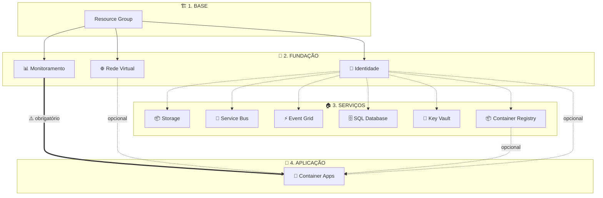
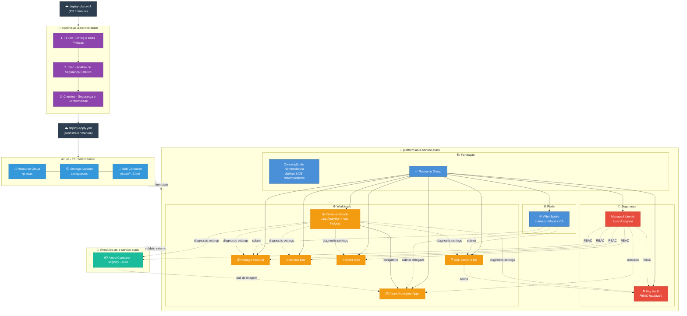

# Platform as a Service Stack

Plataforma de infraestrutura Azure para acelerar o desenvolvimento de produtos através de capacidades de infraestrutura composíveis, seguras e reutilizáveis.

> **Versão 3.0.0**: Implementação completa com convenções de nomenclatura determinísticas (sufixos MD5), segurança baseada em RBAC e feature flags abrangentes.

---

## O que é Engenharia de Plataforma?

Imagine que cada time de desenvolvimento precisa construir a própria casa antes de começar a morar nela — instalar encanamento, eletricidade, internet, alarme... **toda vez, do zero**. Isso é o que acontece quando não existe uma plataforma.

 O time de plataforma entrega a infraestrutura completa: rede, segurança, banco de dados, monitoramento. E os times de produto só precisam se preocupar com o que realmente importa: **o código do produto**.

### Por que usar?

| Problema sem plataforma | Solução com plataforma |
|------------------------|----------------------|
| Cada time configura infra do zero | Infra pronta em minutos com feature flags |
| Configurações inconsistentes entre times | Padrão único, seguro e auditável |
| Deploy manual e propenso a erros | Pipeline automatizada (CI/CD) |
| Semanas para subir um ambiente | Minutos para provisionar tudo |

### Na prática (o que vamos construir)

```
Dev pede um ambiente → Liga os feature flags → Terraform cria tudo → App roda em Container Apps
```

Tudo **automatizado**, **seguro** e **repetível**. O desenvolvedor não precisa saber como a rede funciona, ele só precisa saber o nome da imagem Docker.


---

## Implementação Principal
- ✅ **Nomenclatura Determinística**: Sufixos baseados em MD5 para nomes de recursos globalmente únicos (sem ciclos de destroy/recreate do `random_string`)
- ✅ **Segurança RBAC-First**: Todos os recursos usam autenticação Azure AD e controle de acesso baseado em roles
- ✅ **Feature Flags**: Todos os recursos são opcionais via variáveis `enable_*` com validação de dependências
- ✅ **Propagação RBAC Temporizada**: 180s de `time_sleep` antes de criar secrets para garantir propagação do RBAC no Azure AD
- ✅ **Role Assignments Determinísticos**: Todos os role assignments usam `uuidv5()` para IDs estáveis entre applies
- ✅ **Observabilidade Completa**: Diagnostic settings integrados quando a Observabilidade está habilitada

### Recursos Implementados
- **Fundação**: Resource Group (com `prevent_destroy`), Convenção de Nomenclatura, Managed Identity
- **Rede**: VNet Spoke com subnets default + delegadas para Container Apps
- **Segurança**: Key Vault (RBAC habilitado), Managed Identity
- **Workloads**: Storage Account (somente Azure AD), Service Bus (Standard), Event Grid, SQL Server (admin AAD), Observabilidade, Container Registry (ACR), Container Apps
- **Integração Zero-Config**: Container Apps Environment já vem com MI anexada + roles ACR pré-configuradas — devs só definem o nome da imagem

---

## Início Rápido

### 1. Pré-requisitos

- Assinatura Azure
- Terraform 1.9.0+
- Repositório GitHub com Actions habilitado
- Azure Service Principal com permissões apropriadas

### 2. Configurar GitHub Secrets

Adicione os seguintes secrets ao seu repositório:
- `AZURE_CLIENT_ID`
- `AZURE_CLIENT_SECRET`
- `AZURE_TENANT_ID`
- `AZURE_SUBSCRIPTION_ID`

### 3. Provisionar Infraestrutura

#### Via GitHub Actions (Recomendado)

A plataforma usa dois workflows separados:

- **Plan** (`deploy-plan.yml`): Disparado em Pull Requests para `main` ou manualmente via `workflow_dispatch`. Executa a validação do [pipeline-as-a-service-stack](../pipeline-as-a-service-stack) (TFLint, tfsec, Checkov) antes do plan.
- **Apply** (`deploy-apply.yml`): Disparado em push para `main` ou manualmente via `workflow_dispatch`. Executa `terraform apply` com auto-approve.

**Para fazer deploy:**
1. Vá em **Actions** → **Deploy Platform Infrastructure** (apply) ou **Plan Platform Infrastructure** (plan)
2. Clique em **Run workflow**
3. Preencha o nome da plataforma (somente letras minúsculas e números)
4. Selecione os recursos para provisionar usando os checkboxes de feature flags
5. Revise o output do plan (postado como comentário no PR)

> **Nota**: Destroy não está disponível via workflow. Para destruir recursos, delete o Resource Group no Azure Portal e remova o arquivo de state do storage account.

**Proteção de State**: Ambos os workflows verificam o Terraform state existente e forçam a habilitação de flags para recursos já provisionados, prevenindo destruição acidental.


---

## Feature Flags

Todos os recursos são controlados por feature flags booleanos. Habilite apenas o que precisar:

| Flag | Recurso | Padrão | Dependências |
|------|---------|--------|---------------|
| `enable_managed_identity` | Managed Identity (User-Assigned) | `true` | **Recomendado por**: Storage, Service Bus, Event Grid, SQL, Key Vault |
| `enable_vnet` | Virtual Network Spoke | `true` | Nenhuma |
| `enable_observability` | Log Analytics + App Insights | `true` | **Obrigatório para**: Container Apps |
| `enable_key_vault` | Key Vault com RBAC | `true` | Usa: Managed Identity, SQL (armazena senha) |
| `enable_storage` | Storage Account | `true` | Usa: Managed Identity, VNet |
| `enable_service_bus` | Service Bus Namespace | `true` | Usa: Managed Identity |
| `enable_event_grid` | Event Grid Domain | `true` | Usa: Managed Identity, Service Bus |
| `enable_sql` | SQL Server & Database | `true` | Usa: Managed Identity, VNet |
| `enable_container_registry` | Container Registry (ACR) | `true` | Usa: Managed Identity |
| `container_registry_sku` | SKU do Container Registry | `"Basic"` | Basic, Standard, Premium |
| `enable_container_apps` | Container Apps Environment | `true` | **Requer**: Observabilidade; Usa: Container Registry, MI |

---

## Dependências de Recursos

### Visão Simplificada


---

### Visão Detalhada

```
┌─────────────────────────────────────────────────────────────────────────────┐
│                        RECURSOS INDEPENDENTES                                │
│  (podem ser criados sem dependências)                                        │
├─────────────────────────────────────────────────────────────────────────────┤
│  ✅ Resource Group      - Sempre criado (base de tudo)                       │
│  🔐 Managed Identity    - Opcional (enable_managed_identity)                 │
│      ⚠️  RECOMENDADO por: Storage, Service Bus, Event Grid, SQL, Key Vault  │
│  🌐 VNet Spoke          - Opcional (enable_vnet)                             │
│  📊 Observability       - Opcional (enable_observability)                    │
│  📦 Container Registry  - Opcional (enable_container_registry)               │
└─────────────────────────────────────────────────────────────────────────────┘
                                    │
                                    ▼
┌─────────────────────────────────────────────────────────────────────────────┐
│                      RECURSOS COM DEPENDÊNCIAS OPCIONAIS                     │
│  (podem usar outros recursos se habilitados)                                 │
├─────────────────────────────────────────────────────────────────────────────┤
│  📦 Storage Account                                                          │
│      └── Usa: Managed Identity (RBAC), VNet (network rules)                  │
│  📨 Service Bus                                                              │
│      └── Usa: Managed Identity (RBAC)                                        │
│  ⚡ Event Grid                                                               │
│      └── Usa: Managed Identity (RBAC), Service Bus (subscriptions)           │
│  🗄️ SQL Server & Database                                                   │
│      └── Usa: Managed Identity (RBAC), VNet (firewall rules)                 │
│  🔐 Key Vault                                                                │
│      └── Usa: Managed Identity (RBAC)                                        │
│      └── Armazena: SQL password (se enable_sql=true)                         │
│  📦 Container Registry                                                       │
│      └── Usa: Managed Identity (RBAC: AcrPush + AcrPull)                     │
└─────────────────────────────────────────────────────────────────────────────┘
                                    │
                                    ▼
┌─────────────────────────────────────────────────────────────────────────────┐
│                      RECURSOS COM DEPENDÊNCIAS OBRIGATÓRIAS                  │
│  (REQUEREM outros recursos para funcionar)                                   │
├─────────────────────────────────────────────────────────────────────────────┤
│  📦 Container Apps                                                           │
│      └── REQUER: Observability (Log Analytics workspace_id)                  │
│      └── Usa: VNet (infrastructure_subnet_id) [opcional]                     │
│      └── Usa: Container Registry (login_server) [opcional]                   │
│      └── Usa: Managed Identity (attached to Environment) [opcional]          │
│      ⚠️  NÃO será criado se enable_observability = false                     │
└─────────────────────────────────────────────────────────────────────────────┘
```

### Matriz de Dependências

| Recurso | Depende de (OBRIGATÓRIO) | Usa (OPCIONAL) | Condição de Criação |
|---------|-------------------------|----------------|---------------------|
| Resource Group | - | - | Sempre criado |
| Managed Identity | Resource Group | - | `enable_managed_identity = true` |
| VNet Spoke | Resource Group | - | `enable_vnet = true` |
| Observability | Resource Group | - | `enable_observability = true` |
| Storage Account | Resource Group | Managed Identity, VNet | `enable_storage = true` |
| Service Bus | Resource Group | Managed Identity | `enable_service_bus = true` |
| Event Grid | Resource Group | Managed Identity, Service Bus | `enable_event_grid = true` |
| SQL | Resource Group | Managed Identity, VNet | `enable_sql = true` |
| Key Vault | Resource Group | Managed Identity, SQL* | `enable_key_vault = true` |
| Container Registry | Resource Group | Managed Identity | `enable_container_registry = true` |
| **Container Apps** | **Observability** | VNet, Container Registry, MI | `enable_container_apps = true AND enable_observability = true` |

> \* Key Vault depende do SQL apenas para armazenar a senha gerada. Se `enable_sql = false`, o Key Vault é criado sem secrets.

---

## Exemplos de Uso

### Deploy Completo (todos os recursos)
```hcl
name = "myplatform"
# Todos os enable_* flags são true por padrão
# Inclui: MI, VNet, Observabilidade, Key Vault, Storage, Service Bus, Event Grid, SQL, Container Registry, Container Apps
```

## Convenções de Nomenclatura

Todos os recursos seguem os padrões do [Microsoft Cloud Adoption Framework](https://learn.microsoft.com/en-us/azure/cloud-adoption-framework/ready/azure-best-practices/resource-naming) com sufixos MD5 determinísticos para unicidade global:

### Detalhes do Padrão de Nomenclatura

- **Sufixo MD5**: Gerado a partir de `substr(md5(var.name), 0, 4)` - mesmo nome sempre produz o mesmo sufixo
- **Abreviações de Localização**: eastus2=eus2, westus2=wus2, etc.
- **Determinístico**: SEM sufixos aleatórios - garante nomes de recursos estáveis entre applies

| Recurso | Padrão | Exemplo | Notas |
|---------|--------|---------|-------|
| Resource Group | `rg-{name}-{region}` | `rg-myplatform-eus2` | Lifecycle: prevent_destroy=true |
| Virtual Network | `vnet-{name}-{region}` | `vnet-myplatform-eus2` | Contém subnets default + delegadas |
| Subnet Container Apps | `snet-ca-{name}-{region}` | `snet-ca-myplatform-eus2` | /27 mínimo, delegada ao Microsoft.App/environments |
| Managed Identity | `id-{name}-{region}` | `id-myplatform-eus2` | Tipo User-Assigned |
| Key Vault | `kv{name}{region}{md5}` | `kvmyplatformeus2abc1` | RBAC habilitado, 180s de delay para propagação RBAC |
| Storage Account | `st{name}{region}{md5}` | `stmyplatformeus2abc1` | Sem chaves compartilhadas, somente Azure AD, blobs + containers |
| Service Bus | `sb-{name}-{region}-{md5}` | `sb-myplatform-eus2-abc1` | Tier Standard, inclui Queue e Topic |
| Event Grid Domain | `evgd-{name}-{region}` | `evgd-myplatform-eus2` | Tipo Domain para roteamento de eventos, integração Service Bus |
| SQL Server | `sql-{name}-{region}-{md5}` | `sql-myplatform-eus2-abc1` | Identidade System-Assigned, admin AAD, TLS 1.2+ |
| SQL Database | `sqldb-{name}-{region}` | `sqldb-myplatform-eus2` | Compatível com elastic pool, diagnostic logging |
| Log Analytics | `log-{name}-{region}` | `log-myplatform-eus2` | Retenção de 30 dias, workspace para diagnostic settings |
| App Insights | `appi-{name}-{region}` | `appi-myplatform-eus2` | Tipo: web, vinculado ao Log Analytics |
| Container Registry | `cr{name}{region}{md5}` | `crmyplatformeus2abc1` | Somente alfanumérico, RBAC ACR Push/Pull auto-atribuído |
| Container Apps Env | `cae-{name}-{region}-{md5}` | `cae-myplatform-eus2-abc1` | Requer Log Analytics, MI + ACR pré-configurados, subnet /27 delegada (opcional) |

---

## Architecture

```
┌─────────────────────────────────────────────────────────┐
│                    GitHub Actions                        │
│    deploy-plan.yml ──► pipeline-core validation          │
│    deploy-apply.yml ──► terraform apply                  │
└────────────────────┬────────────────────────────────────┘
                     │
                     ▼
┌─────────────────────────────────────────────────────────┐
│            pipeline-as-a-service-stack                    │
│   (TFLint, tfsec, Checkov, terraform-docs, tf-cost)      │
└────────────────────┬────────────────────────────────────┘
                     │
                     ▼
┌─────────────────────────────────────────────────────────┐
│                  Terraform Modules                       │
├─────────────────────────────────────────────────────────┤
│ Foundation  │ naming, resource-group                     │
│ Networking  │ vnet-spoke                                 │
│ Security    │ managed-identity, key-vault                │
│ Workloads   │ storage, service-bus, event-grid,          │
│             │ observability, sql, container-registry*,   │
│             │ container-apps                             │
└─────────────────────────────────────────────────────────┘
                     │
                     ▼
┌─────────────────────────────────────────────────────────┐
│                   Azure Resources                        │
└─────────────────────────────────────────────────────────┘

* container-registry sourced from tfmodules-as-a-service-stack (external module)
```

---

## Estrutura do Repositório

```
platform-as-a-service-stack/
├── .github/
│   ├── agents/                      # Definições de agentes Copilot
│   │   ├── agent.agent.md
│   │   ├── azure-agent.md
│   │   ├── github-actions-agent.md
│   │   └── terraform-agent.md
│   ├── instructions/                # Instruções de codificação Copilot
│   │   ├── azure-instructions.md
│   │   ├── github-actions-platform-instructions.md
│   │   └── terraform-platform-instructions.md
│   ├── prompts/                     # Templates de prompts Copilot
│   │   ├── azure-prompt.md
│   │   ├── github-actions-prompt.md
│   │   └── terraform-prompt.md
│   ├── skills/                      # Skills do Copilot
│   │   ├── azure-platform-stack/
│   │   ├── github-actions-platform-stack/
│   │   └── terraform-platform-stack/
│   └── workflows/
│       ├── deploy-apply.yml         # Workflow de Apply (push main / manual)
│       └── deploy-plan.yml          # Workflow de Plan (PR main / manual)
├── terraform/
│   ├── modules/
│   │   ├── foundation/
│   │   │   ├── naming/              # Módulo de convenção de nomenclatura
│   │   │   └── resource-group/      # Módulo de resource group
│   │   ├── networking/
│   │   │   └── vnet-spoke/          # Módulo de rede virtual
│   │   ├── security/
│   │   │   ├── managed-identity/    # Módulo de managed identity
│   │   │   └── key-vault/           # Módulo de key vault
│   │   └── workloads/
│   │       ├── storage-account/     # Módulo de storage account
│   │       ├── service-bus/         # Módulo de Service Bus
│   │       ├── event-grid/          # Módulo de Event Grid
│   │       ├── observability/       # Log Analytics + App Insights
│   │       ├── sql/                 # SQL Server & Database
│   │       └── container-apps/      # Módulo de Container Apps
│   │       # container-registry → externo: tfmodules-as-a-service-stack
│   ├── backend.tf                   # Configuração de state remoto
│   ├── providers.tf                 # Configuração de providers
│   ├── main.tf                      # Orquestração do módulo raiz
│   ├── variables.tf                 # Variáveis de entrada com feature flags
│   └── outputs.tf                   # Outputs da plataforma
├── prompt.md                        # Especificação do projeto
└── README.md                        # Este arquivo
```

<!-- BEGIN_TF_DOCS -->
## Requisitos

| Nome | Versão |
|------|---------|
| <a name="requirement_terraform"></a> [terraform](#requirement\_terraform) | >= 1.9.0 |
| <a name="requirement_azurerm"></a> [azurerm](#requirement\_azurerm) | ~> 4.57 |
| <a name="requirement_null"></a> [null](#requirement\_null) | ~> 3.2 |
| <a name="requirement_random"></a> [random](#requirement\_random) | ~> 3.8 |
| <a name="requirement_time"></a> [time](#requirement\_time) | ~> 0.13 |

## Provedores

| Nome | Versão |
|------|---------|
| <a name="provider_azurerm"></a> [azurerm](#provider\_azurerm) | ~> 4.57 |
| <a name="provider_null"></a> [null](#provider\_null) | ~> 3.2 |

## Módulos

| Nome | Fonte | Versão |
|------|--------|---------|
| <a name="module_container_apps"></a> [container\_apps](#module\_container\_apps) | ./modules/workloads/container-apps | n/a |
| <a name="module_container_registry"></a> [container\_registry](#module\_container\_registry) | git::https://github.com/orafaelferreiraa/tfmodules-as-a-service-stack.git//modules/azurerm_container_registry | 1.0.3 |
| <a name="module_event_grid"></a> [event\_grid](#module\_event\_grid) | ./modules/workloads/event-grid | n/a |
| <a name="module_key_vault"></a> [key\_vault](#module\_key\_vault) | ./modules/security/key-vault | n/a |
| <a name="module_managed_identity"></a> [managed\_identity](#module\_managed\_identity) | ./modules/security/managed-identity | n/a |
| <a name="module_naming"></a> [naming](#module\_naming) | ./modules/foundation/naming | n/a |
| <a name="module_observability"></a> [observability](#module\_observability) | ./modules/workloads/observability | n/a |
| <a name="module_resource_group"></a> [resource\_group](#module\_resource\_group) | ./modules/foundation/resource-group | n/a |
| <a name="module_service_bus"></a> [service\_bus](#module\_service\_bus) | ./modules/workloads/service-bus | n/a |
| <a name="module_sql"></a> [sql](#module\_sql) | ./modules/workloads/sql | n/a |
| <a name="module_storage_account"></a> [storage\_account](#module\_storage\_account) | ./modules/workloads/storage-account | n/a |
| <a name="module_vnet_spoke"></a> [vnet\_spoke](#module\_vnet\_spoke) | ./modules/networking/vnet-spoke | n/a |

## Recursos

| Nome | Tipo |
|------|------|
| [azurerm_client_config.current](https://registry.terraform.io/providers/hashicorp/azurerm/latest/docs/data-sources/client_config) | data source |

## Entradas

| Nome | Descrição | Tipo | Padrão | Obrigatório |
|------|-------------|------|---------|:--------:|
| <a name="input_enable_container_apps"></a> [enable\_container\_apps](#input\_enable\_container\_apps) | Habilitar Container Apps Environment | `bool` | `true` | não |
| <a name="input_enable_container_registry"></a> [enable\_container\_registry](#input\_enable\_container\_registry) | Habilitar Container Registry (ACR) | `bool` | `true` | não |
| <a name="input_container_registry_sku"></a> [container\_registry\_sku](#input\_container\_registry\_sku) | SKU do Container Registry. Valores possíveis: Basic, Standard, Premium | `string` | `"Basic"` | não |
| <a name="input_enable_event_grid"></a> [enable\_event\_grid](#input\_enable\_event\_grid) | Habilitar Event Grid | `bool` | `true` | não |
| <a name="input_enable_key_vault"></a> [enable\_key\_vault](#input\_enable\_key\_vault) | Habilitar Key Vault | `bool` | `true` | não |
| <a name="input_enable_managed_identity"></a> [enable\_managed\_identity](#input\_enable\_managed\_identity) | Habilitar Managed Identity (necessário para: Storage, Service Bus, Event Grid, SQL, Key Vault para RBAC) | `bool` | `true` | não |
| <a name="input_enable_observability"></a> [enable\_observability](#input\_enable\_observability) | Habilitar Observabilidade (Log Analytics, Application Insights) | `bool` | `true` | não |
| <a name="input_enable_service_bus"></a> [enable\_service\_bus](#input\_enable\_service\_bus) | Habilitar Service Bus | `bool` | `true` | não |
| <a name="input_enable_sql"></a> [enable\_sql](#input\_enable\_sql) | Habilitar SQL Server e Database | `bool` | `true` | não |
| <a name="input_enable_storage"></a> [enable\_storage](#input\_enable\_storage) | Habilitar Storage Account | `bool` | `true` | não |
| <a name="input_enable_vnet"></a> [enable\_vnet](#input\_enable\_vnet) | Habilitar Virtual Network Spoke | `bool` | `true` | não |
| <a name="input_location"></a> [location](#input\_location) | Região Azure para os recursos | `string` | `"eastus2"` | não |
| <a name="input_name"></a> [name](#input\_name) | Nome da plataforma (time ou produto - alfanumérico minúsculo) | `string` | n/a | sim |
| <a name="input_sql_administrator_login"></a> [sql\_administrator\_login](#input\_sql\_administrator\_login) | Nome de login do administrador do SQL Server | `string` | `"sql_admin"` | não |
| <a name="input_subscription_id"></a> [subscription\_id](#input\_subscription\_id) | ID da Assinatura Azure | `string` | n/a | sim |
| <a name="input_tags"></a> [tags](#input\_tags) | Tags comuns para aplicar em todos os recursos | `map(string)` | `{}` | não |

## Saídas

| Nome | Descrição |
|------|-------------|
| <a name="output_application_insights_connection_string"></a> [application\_insights\_connection\_string](#output\_application\_insights\_connection\_string) | String de conexão do Application Insights |
| <a name="output_application_insights_instrumentation_key"></a> [application\_insights\_instrumentation\_key](#output\_application\_insights\_instrumentation\_key) | Chave de instrumentação do Application Insights |
| <a name="output_container_apps_environment_id"></a> [container\_apps\_environment\_id](#output\_container\_apps\_environment\_id) | ID do Container Apps Environment |
| <a name="output_container_apps_environment_name"></a> [container\_apps\_environment\_name](#output\_container\_apps\_environment\_name) | Nome do Container Apps Environment |
| <a name="output_container_apps_environment_default_domain"></a> [container\_apps\_environment\_default\_domain](#output\_container\_apps\_environment\_default\_domain) | Domínio padrão do Container Apps Environment |
| <a name="output_container_apps_environment_static_ip"></a> [container\_apps\_environment\_static\_ip](#output\_container\_apps\_environment\_static\_ip) | IP estático do Container Apps Environment |
| <a name="output_container_app_ready_config"></a> [container\_app\_ready\_config](#output\_container\_app\_ready\_config) | Config zero para Container Apps. MI anexada ao Environment com AcrPull/AcrPush no ACR |
| <a name="output_container_registry_id"></a> [container\_registry\_id](#output\_container\_registry\_id) | ID do Container Registry |
| <a name="output_container_registry_name"></a> [container\_registry\_name](#output\_container\_registry\_name) | Nome do Container Registry |
| <a name="output_container_registry_login_server"></a> [container\_registry\_login\_server](#output\_container\_registry\_login\_server) | URL do login server do Container Registry |
| <a name="output_event_grid_domain_id"></a> [event\_grid\_domain\_id](#output\_event\_grid\_domain\_id) | ID do domínio Event Grid |
| <a name="output_key_vault_id"></a> [key\_vault\_id](#output\_key\_vault\_id) | ID do Key Vault |
| <a name="output_key_vault_uri"></a> [key\_vault\_uri](#output\_key\_vault\_uri) | URI do Key Vault |
| <a name="output_log_analytics_workspace_id"></a> [log\_analytics\_workspace\_id](#output\_log\_analytics\_workspace\_id) | ID do Log Analytics Workspace |
| <a name="output_managed_identity_client_id"></a> [managed\_identity\_client\_id](#output\_managed\_identity\_client\_id) | Client ID da managed identity |
| <a name="output_managed_identity_id"></a> [managed\_identity\_id](#output\_managed\_identity\_id) | ID da managed identity |
| <a name="output_managed_identity_principal_id"></a> [managed\_identity\_principal\_id](#output\_managed\_identity\_principal\_id) | Principal ID da managed identity |
| <a name="output_resource_group_id"></a> [resource\_group\_id](#output\_resource\_group\_id) | ID do resource group |
| <a name="output_resource_group_name"></a> [resource\_group\_name](#output\_resource\_group\_name) | Nome do resource group |
| <a name="output_service_bus_namespace_id"></a> [service\_bus\_namespace\_id](#output\_service\_bus\_namespace\_id) | ID do namespace do Service Bus |
| <a name="output_service_bus_namespace_name"></a> [service\_bus\_namespace\_name](#output\_service\_bus\_namespace\_name) | Nome do namespace do Service Bus |
| <a name="output_sql_database_id"></a> [sql\_database\_id](#output\_sql\_database\_id) | ID do banco de dados SQL |
| <a name="output_sql_server_fqdn"></a> [sql\_server\_fqdn](#output\_sql\_server\_fqdn) | FQDN do servidor SQL |
| <a name="output_sql_server_id"></a> [sql\_server\_id](#output\_sql\_server\_id) | ID do servidor SQL |
| <a name="output_storage_account_id"></a> [storage\_account\_id](#output\_storage\_account\_id) | ID da storage account |
| <a name="output_storage_account_name"></a> [storage\_account\_name](#output\_storage\_account\_name) | Nome da storage account |
| <a name="output_vnet_id"></a> [vnet\_id](#output\_vnet\_id) | ID da VNet |
| <a name="output_vnet_name"></a> [vnet\_name](#output\_vnet\_name) | Nome da VNet |
<!-- END_TF_DOCS -->

---

## Diagrama de Arquitetura

